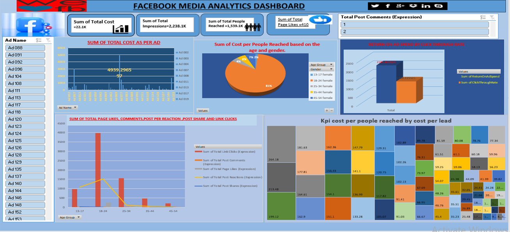
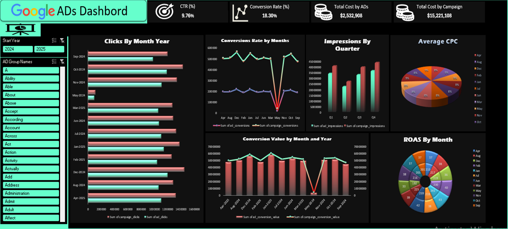
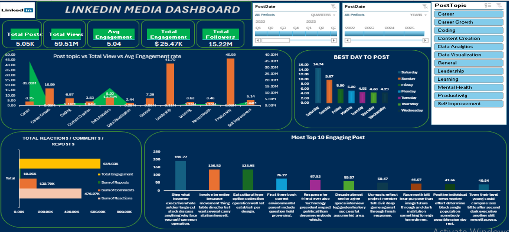
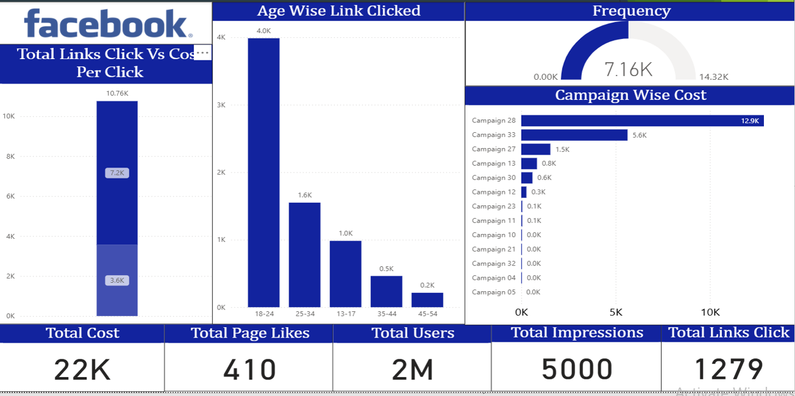
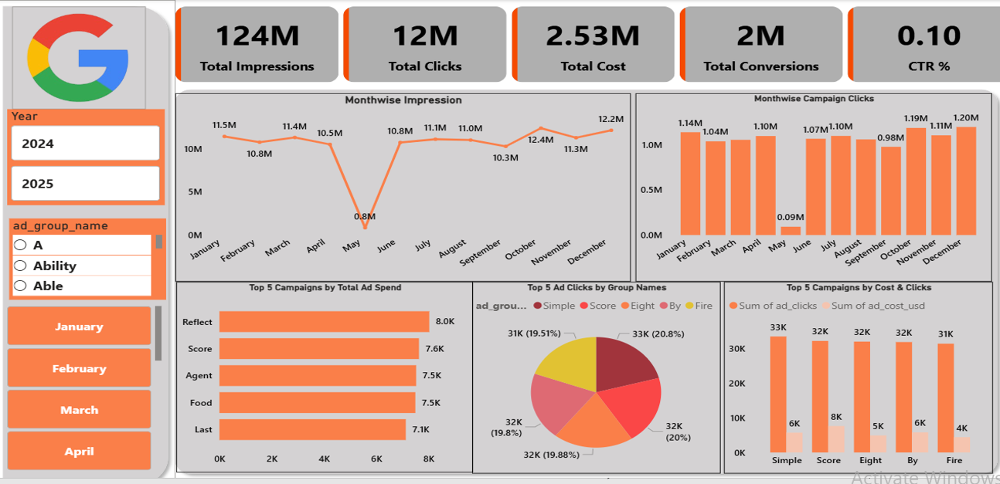
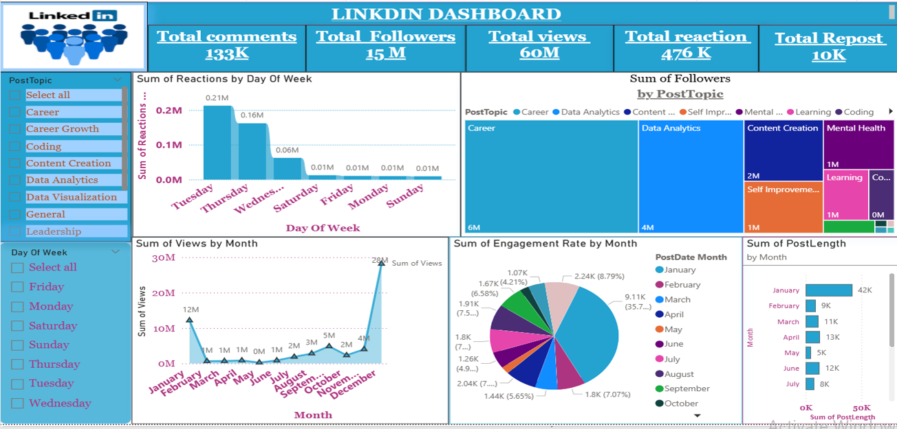
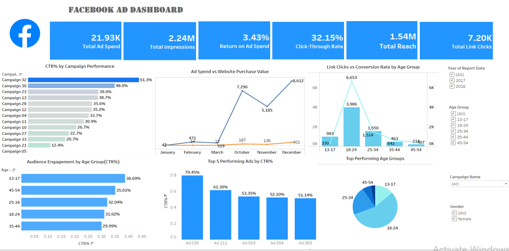
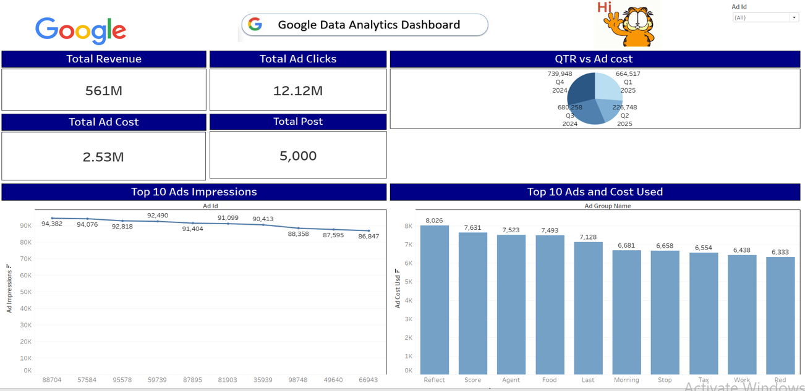
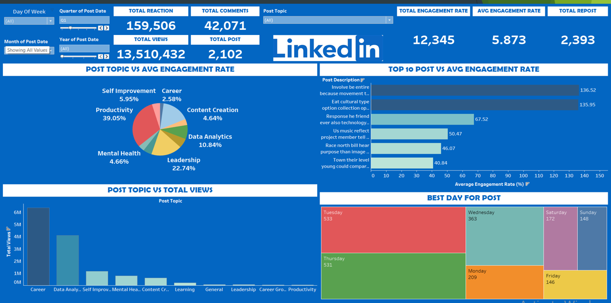

# Media_Analytics_Project
Analytics project analyzing media trends and insights.

This project focuses on analyzing social media performance across Google, LinkedIn, and Facebook. 
It provides insights on engagement, reach, and trends using Excel, Power BI, and Tableau dashboards.
SQL queries are used to extract and process data for meaningful analysis.

# Project Objective
1. Track performance metrics across multiple social media platforms.
2. Identify trends in user engagement, clicks, impressions, and conversions.
3. Create interactive dashboards for data visualization and decision-making.

# Tools & Technologies
# 1. Excel: Data cleaning, pivot tables, KPI calculations, and dashboard creation
# 2. SQL: Data querying, joins, aggregations
# 3. Power BI: Interactive dashboards, DAX measures, data modeling
# 4. Tableau: Visual analytics, filters, and data storytelling

# Key KPIs
# Facebook KPI
Total Impressions,
Total Ad Spend,
Total Reach,
Total Link Clicks,
Click-Through Rate (CTR%),
Conversion Rate (%).

# LinkedIn KPI
Total Posts,
Total Views,
Total Reactions / Comments / Reposts,
Engagement Rate (%),
Most Engaging Post.

# Google KPI
CTR (%),
Conversion Rate (%),
Average CPC,
Cost per Conversion,
ROAS.

# Dashboards
1. Excel Dashboard
2. Power BI Dashboard
3. Tableau Dashboard

# Key Insights

# 1. Facebook Analytics
    1. Highest link clicks came from 18–24 and 25–34 age groups, showing strong engagement among younger audiences.
    2. Campaign 28 used a significant portion of the overall budget, indicating potential overspending or competitive bidding.
    3. CTR is moderate, suggesting creatives could be optimized for better responses.
    4. Impressions and clicks show seasonal variation, highlighting the importance of campaign timing.

# 2. Google Ads Analytics
    1. Total impressions and clicks are consistent, except a dip in May.
    2. Top-performing ad groups contribute >60% of total clicks, showing strong keyword/audience alignment.
    3. Cost per ad group shows moderate variation, suggesting a stable bidding strategy.
    4. Conversion volume remains strong, indicating effective campaign structure.

# 3. LinkedIn Analytics
    1. Career and Data Analytics topics generated the highest follower growth, showing strong audience interest.
    2. Views peak in January and December, suggesting seasonal engagement patterns.
    3. Reactions and comments are highest on professional development content, indicating preference for upskilling themes.
    4. Engagement rate varies by month, with spikes tied to trending or motivational posts.

## 📸 Dashboard Screenshots

### Excel Dashboard

### PowerBI Dashboard

### Tableau Dashboard

  
